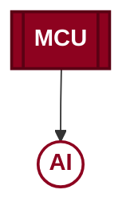

# Brand Icon

Modern embedded systems academy logo, redesigned as a compact circuit-to-AI
motif: a chip (MCU) feeding an AI core over a circuit trace, styled in the
brand's burgundy (#8d021f) so it reads as a mark/logo rather than a generic
flowchart.

